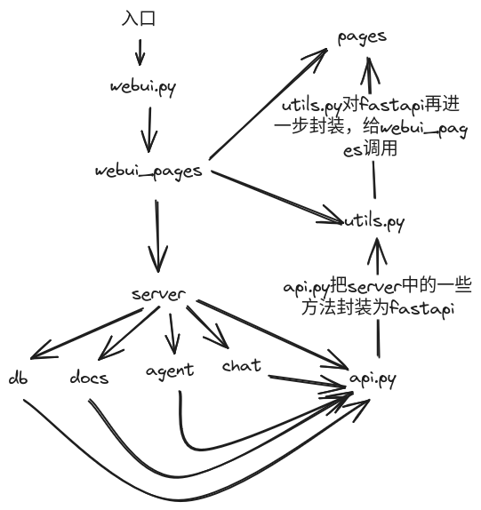

## langchain-chatchat 目前(2023-11)还没对chatglm-cpp项目支持，不能很愉快地利用消费级的电脑进行大模型玩耍。故基于langchain-chatcaht(v0.2.7)做了一些修改，支持chatglm-cpp项目所支持的LLM。

## 目前对langchain-chatchat目改动多一些，后面会把修改部分单独出来，不影响langchain-chatchat，这样可以持续更新langchain-chatchat版本。
PS：langchain-chatchat 所支持的线上LLM API 几乎都是要钱的，且都要注册实名制，恶心。故有此项目

---

## 目录

* [介绍](README.md#介绍)
* [解决的痛点](README.md#解决的痛点)
* [快速上手](README.md#快速上手)
  * [1. 安装部署langchain-chatchat](README.md#1-安装部署langchain-chatchat)
  * [2. 修改/增加的内容](README.md#2-修改/增加的内容)
  * [3. langchain-chatchat代码结构简单梳理](README.md#3-langchain-chatchat代码结构简单梳理)


## 介绍

🤖️ 一种利用 [langchain](https://github.com/hwchase17/langchain) 思想实现的基于本地知识库的问答应用，目标期望建立一套对中文场景与开源模型支持友好、可离线运行的知识库问答解决方案。

💡 受 [GanymedeNil](https://github.com/GanymedeNil) 的项目 [document.ai](https://github.com/GanymedeNil/document.ai) 和 [AlexZhangji](https://github.com/AlexZhangji) 创建的 [ChatGLM-6B Pull Request](https://github.com/THUDM/ChatGLM-6B/pull/216) 启发，建立了全流程可使用开源模型实现的本地知识库问答应用。本项目的最新版本中通过使用 [FastChat](https://github.com/lm-sys/FastChat) 接入 Vicuna, Alpaca, LLaMA, Koala, RWKV 等模型，依托于 [langchain](https://github.com/langchain-ai/langchain) 框架支持通过基于 [FastAPI](https://github.com/tiangolo/fastapi) 提供的 API 调用服务，或使用基于 [Streamlit](https://github.com/streamlit/streamlit) 的 WebUI 进行操作。

✅ 依托于本项目支持的开源 LLM 与 Embedding 模型，本项目可实现全部使用**开源**模型**离线私有部署**。与此同时，本项目也支持 OpenAI GPT API 的调用，并将在后续持续扩充对各类模型及模型 API 的接入。

⛓️ 本项目实现原理如下图所示，过程包括加载文件 -> 读取文本 -> 文本分割 -> 文本向量化 -> 问句向量化 -> 在文本向量中匹配出与问句向量最相似的 `top k`个 -> 匹配出的文本作为上下文和问题一起添加到 `prompt`中 -> 提交给 `LLM`生成回答。

📺 [原理介绍视频](https://www.bilibili.com/video/BV13M4y1e7cN/?share_source=copy_web&vd_source=e6c5aafe684f30fbe41925d61ca6d514)


从文档处理角度来看，实现流程如下：


🚩 本项目未涉及微调、训练过程，但可利用微调或训练对本项目效果进行优化。

🌐 [AutoDL 镜像](https://www.codewithgpu.com/i/chatchat-space/Langchain-Chatchat/Langchain-Chatchat) 中 `v11` 版本所使用代码已更新至本项目 `v0.2.7` 版本。

🐳 [Docker 镜像](registry.cn-beijing.aliyuncs.com/chatchat/chatchat:0.2.6) 已经更新到 ```0.2.7``` 版本。

🌲 一行命令运行 Docker ：

```shell
docker run -d --gpus all -p 80:8501 registry.cn-beijing.aliyuncs.com/chatchat/chatchat:0.2.7
```

🧩 本项目有一个非常完整的[Wiki](https://github.com/chatchat-space/Langchain-Chatchat/wiki/) ， README只是一个简单的介绍，__仅仅是入门教程，能够基础运行__。 如果你想要更深入的了解本项目，或者想对本项目做出贡献。请移步 [Wiki](https://github.com/chatchat-space/Langchain-Chatchat/wiki/)  界面

## 解决的痛点

该项目是一个可以实现 __完全本地化__推理的知识库增强方案, 重点解决数据安全保护，私域化部署的企业痛点。
本开源方案采用```Apache License```，可以免费商用，无需付费。

我们支持市面上主流的本地大预言模型和Embedding模型，支持开源的本地向量数据库。
支持列表详见[Wiki](https://github.com/chatchat-space/Langchain-Chatchat/wiki/)


## 快速上手

### 1. 安装部署langchain-chatchat

详细教程参考[langchain-chatchat](https://github.com/chatchat-space/Langchain-Chatchat)

### 2. 修改/增加的内容

- 1、把chatglm-cpp 封装成openai api的调用方式
- 2、利用chatchat项目本身支持的openai api能力，调用第1步的API接口，获取LLM能力
- 具体步骤：
	- 1、把chatglm-cpp api集成到chatchat 中
	  collapsed:: true
		- 1.1、在chatchat 项目中server目录下创建一个py文件,命名:chatglm_cpp_api.py,把chatglm-cpp 项目中的openai_api.py代码复制到chatglm_cpp_api.py中，然后做下修改。修改后如下：
		  collapsed:: true
			-
			  ```
			  import asyncio
			  import logging
			  import time
			  from typing import List, Literal, Optional, Union
			  
			  import chatglm_cpp
			  from fastapi import FastAPI, HTTPException, Request, status
			  from fastapi.middleware.cors import CORSMiddleware
			  from pydantic import BaseModel, Field
			  from sse_starlette.sse import EventSourceResponse
			  from configs.model_config import VLLM_MODEL_DICT
			  logging.basicConfig(level=logging.INFO, format=r"%(asctime)s - %(module)s - %(levelname)s - %(message)s")
			  
			  
			  
			  
			  
			  class ChatMessage(BaseModel):
			      role: Literal["system", "user", "assistant"]
			      content: str
			  
			  
			  class DeltaMessage(BaseModel):
			      role: Optional[Literal["system", "user", "assistant"]] = None
			      content: Optional[str] = None
			  
			  
			  class ChatCompletionRequest(BaseModel):
			      model: str = "default-model"
			      messages: List[ChatMessage]
			      temperature: float = Field(default=0.95, ge=0.0, le=2.0)
			      top_p: float = Field(default=0.7, ge=0.0, le=1.0)
			      stream: bool = False
			      max_tokens: int = Field(default=2048, ge=0)
			  
			      model_config = {
			          "json_schema_extra": {"examples": [{"model": "default-model", "messages": [{"role": "user", "content": "你好"}]}]}
			      }
			  
			  class ChatCompletionRequest1(BaseModel):
			      model: str = "default-model"
			      messages: List[ChatMessage]
			      temperature: float = Field(default=0.95, ge=0.0, le=2.0)
			      max_tokens: int = Field(default=2048, ge=0)
			      stream: bool = False
			      n: int = Field(default=1, ge=0)
			      top_p: float = Field(default=0.7, ge=0.0, le=1.0)
			  
			  
			  class ChatCompletionResponseChoice(BaseModel):
			      index: int = 0
			      message: ChatMessage
			      finish_reason: Literal["stop", "length"] = "stop"
			  
			  
			  class ChatCompletionResponseStreamChoice(BaseModel):
			      index: int = 0
			      delta: DeltaMessage
			      finish_reason: Optional[Literal["stop", "length"]] = None
			  
			  
			  class ChatCompletionResponse(BaseModel):
			      id: str = "chatcmpl"
			      model: str = "default-model"
			      object: Literal["chat.completion", "chat.completion.chunk"]
			      created: int = Field(default_factory=lambda: int(time.time()))
			      choices: Union[List[ChatCompletionResponseChoice], List[ChatCompletionResponseStreamChoice]]
			  
			      model_config = {
			          "json_schema_extra": {
			              "examples": [
			                  {
			                      "id": "chatcmpl",
			                      "model": "default-model",
			                      "object": "chat.completion",
			                      "created": 1691166146,
			                      "choices": [
			                          {
			                              "index": 0,
			                              "message": {"role": "assistant", "content": "你好👋！我是人工智能助手 ChatGLM2-6B，很高兴见到你，欢迎问我任何问题。"},
			                              "finish_reason": "stop",
			                          }
			                      ],
			                  }
			              ]
			          }
			      }
			  
			  app = FastAPI()
			  app.add_middleware(
			      CORSMiddleware, allow_origins=["*"], allow_credentials=True, allow_methods=["*"], allow_headers=["*"]
			  )
			  pipeline = chatglm_cpp.Pipeline(VLLM_MODEL_DICT['chatglm-cpp'])
			  lock = asyncio.Lock()
			  
			  
			  def stream_chat(history, body):
			      yield ChatCompletionResponse(
			          object="chat.completion.chunk",
			          choices=[ChatCompletionResponseStreamChoice(delta=DeltaMessage(role="assistant"))],
			      )
			  
			      for piece in pipeline.chat(
			          history,
			          max_length=body.max_tokens,
			          do_sample=body.temperature > 0,
			          top_p=body.top_p,
			          temperature=body.temperature,
			          num_threads=0,
			          stream=True,
			      ):
			          yield ChatCompletionResponse(
			              object="chat.completion.chunk",
			              choices=[ChatCompletionResponseStreamChoice(delta=DeltaMessage(content=piece))],
			          )
			  
			      yield ChatCompletionResponse(
			          object="chat.completion.chunk",
			          choices=[ChatCompletionResponseStreamChoice(delta=DeltaMessage(), finish_reason="stop")],
			      )
			  
			  
			  async def stream_chat_event_publisher(history, body):
			      output = ""
			      try:
			          async with lock:
			              for chunk in stream_chat(history, body):
			                  await asyncio.sleep(0)  # yield control back to event loop for cancellation check
			                  output += chunk.choices[0].delta.content or ""
			                  yield chunk.model_dump_json(exclude_unset=True)
			          logging.info(f'prompt: "{history[-1]}", stream response: "{output}"')
			      except asyncio.CancelledError as e:
			          logging.info(f'prompt: "{history[-1]}", stream response (partial): "{output}"')
			          raise e
			  
			  # @app.middleware("http")
			  # async def log_request(request: Request, call_next):
			  #     # 打印请求参数
			  #     print(f"请求参数: {await request.json()}")
			      
			  #     response = await call_next(request)
			  #     return response
			  
			  @app.post("/v1/chat/completions")
			  async def create_chat_completion(body: ChatCompletionRequest) -> ChatCompletionResponse:
			      # ignore system messages
			      history = [msg.content for msg in body.messages if msg.role != "system"]
			      if len(history) % 2 != 1:
			          raise HTTPException(status.HTTP_400_BAD_REQUEST, "invalid history size")
			  
			      if body.stream:
			          generator = stream_chat_event_publisher(history, body)
			          return EventSourceResponse(generator)
			  
			      output = pipeline.chat(
			          history=history,
			          max_length=body.max_tokens,
			          do_sample=body.temperature > 0,
			          top_p=body.top_p,
			          temperature=body.temperature,
			      )
			      logging.info(f'prompt: "{history[-1]}", sync response: "{output}"')
			  
			      return ChatCompletionResponse(
			          object="chat.completion",
			          choices=[ChatCompletionResponseChoice(message=ChatMessage(role="assistant", content=output))],
			      )
			  
			  
			  class ModelCard(BaseModel):
			      id: str
			      object: Literal["model"] = "model"
			      owned_by: str = "owner"
			      permission: List = []
			  
			  
			  class ModelList(BaseModel):
			      object: Literal["list"] = "list"
			      data: List[ModelCard] = []
			  
			      model_config = {
			          "json_schema_extra": {
			              "examples": [
			                  {
			                      "object": "list",
			                      "data": [{"id": "gpt-3.5-turbo", "object": "model", "owned_by": "owner", "permission": []}],
			                  }
			              ]
			          }
			      }
			  
			  
			  @app.get("/v1/models")
			  async def list_models() -> ModelList:
			      return ModelList(data=[ModelCard(id="gpt-3.5-turbo")])
			  
			  ```
		- 1.2、修改startup.py，加入chatglm_cpp api 的启动
			- 增加一个server启动函数
			-
			  ```
			  def run_chatglmCpp_api_server(started_event: mp.Event = None, run_mode: str = None):
			      import uvicorn
			      from server.chatglm_cpp_api import app
			  
			      _set_app_event(app, started_event)
			  
			      host = CHATGLM_CPP_SERVER["host"]
			      port = CHATGLM_CPP_SERVER["port"]
			  
			      uvicorn.run(app, host=host, port=port)
			  ```
			- 添加一个run_chatglmCpp_api_server的启动参数:chatglmCPPapi
				-
				  ```
				  if args.chatglmCPPapi:
				          process = Process(
				              target=run_chatglmCpp_api_server,
				              name=f"chatglmCPP_API Server",
				              kwargs=dict(started_event=chatglmCPPapi_started, run_mode=run_mode),
				              daemon=True,
				          )
				          processes["chatglmCPPapi"] = process
				  ```
				- 在-a参数，-llm_api参数处把该参数chatglmCPPapi赋值为true
				-
				  ```
				  chatglmCPPapi_started = manager.Event()
				      if args.chatglmCPPapi:
				          process = Process(
				              target=run_chatglmCpp_api_server,
				              name=f"chatglmCPP_API Server",
				              kwargs=dict(started_event=chatglmCPPapi_started, run_mode=run_mode),
				              daemon=True,
				          )
				          processes["chatglmCPPapi"] = process
				  ```
				-
				  ```
				  if args.all_webui:
				          args.openai_api = True
				          args.model_worker = True
				          args.api = True
				          args.api_worker = True
				          args.webui = True
				          args.chatglmCPPapi = True #在-a参数中把该参数设置为真
				  ```
				- 增加对chatglm-cpp api的事务控制
					-
					  ```
					  if p:= processes.get("chatglmCPPapi"):
					      p.start()
					      p.name = f"{p.name} ({p.pid})"
					      chatglmCPPapi_started.wait() # 等待chatglmCPPapi启动完成
					  ```
			-
	- 2、修改server/chat/openai_chat.py,使得其openai_chat的传人参数符合chatglm cpp 封装好的openaiapi的传入参数
	  collapsed:: true
		-
		  ```
		  from fastapi.responses import StreamingResponse
		  from typing import List, Optional,Literal
		  import openai
		  from configs import LLM_MODELS, logger, log_verbose
		  from server.utils import get_model_worker_config, fschat_openai_api_address
		  from pydantic import BaseModel,Field
		  from server.db.repository import add_chat_history_to_db, update_chat_history
		  import json
		  
		  
		  class OpenAiMessage(BaseModel):
		      role: str = "user"
		      content: str = "hello"
		  
		  
		  class OpenAiChatMsgIn(BaseModel):
		      model: str = LLM_MODELS[0]
		      messages: List[OpenAiMessage]
		      temperature: float = 0.7
		      n: int = 1
		      max_tokens: Optional[int] = None
		      stop: List[str] = []
		      stream: bool = False
		      presence_penalty: int = 0
		      frequency_penalty: int = 0
		  
		  ###增加内容
		  class ChatMessage(BaseModel):
		      role: Literal["system", "user", "assistant"]
		      content: str
		  class ChatCompletionRequest(BaseModel):
		      model: str = "default-model"
		      messages: List[ChatMessage]
		      temperature: float = Field(default=0.95, ge=0.0, le=2.0)
		      top_p: float = Field(default=0.7, ge=0.0, le=1.0)
		      stream: bool = False
		      max_tokens: int = Field(default=2048, ge=0)
		  
		      model_config = {
		          "json_schema_extra": {"examples": [{"model": "default-model", "messages": [{"role": "user", "content": "你好"}]}]}
		      }
		  
		  
		  async def openai_chat(msg: ChatCompletionRequest):
		      config = get_model_worker_config(msg.model)
		      openai.api_key = config.get("api_key", "EMPTY")
		      print(f"{openai.api_key=}")
		      openai.api_base = config.get("api_base_url", fschat_openai_api_address())
		      print(fschat_openai_api_address())
		      print(f"{openai.api_base=}")
		      print(msg)
		  
		      async def get_response(msg):
		          data = msg.dict()
		          ###这里openai传参方式，要一个个传，不能直接**data
		          try:
		              response = await openai.ChatCompletion.acreate(model=data['model'],
		                                          messages=data['messages'],
		                                          temperature=data['temperature'],
		                                          top_p=data['top_p'],
		                                          stream=data['stream'],
		                                          max_tokens=data['max_tokens'])
		              chat_history_id = add_chat_history_to_db(chat_type="llm_chat", query=data['messages'][0]['content'])
		              if msg.stream:
		                  async for data in response:
		                      if choices := data.choices:
		                          if chunk := choices[0].get("delta", {}).get("content"):
		                              print(chunk, end="", flush=True)
		                              ##修改返回，返回json
		                              yield json.dumps(
		                                  {"text": chunk, "chat_history_id": chat_history_id},
		                                  ensure_ascii=False)
		              else:
		                  if response.choices:
		                      answer = response.choices[0].message.content
		                      print(answer)
		                      ##修改返回，返回json
		                      yield json.dumps(
		                                  {"text": answer, "chat_history_id": chat_history_id},
		                                  ensure_ascii=False)
		          except Exception as e:
		              msg = f"获取ChatCompletion时出错：{e}"
		              logger.error(f'{e.__class__.__name__}: {msg}',
		                           exc_info=e if log_verbose else None)
		  
		      return StreamingResponse(
		          get_response(msg),
		          media_type='text/event-stream',
		      )
		  
		  ```
	- 3、在server/api.py中把对话部分的模型全换成openai_chat
	  collapsed:: true
		-
		  ```
		  app.post("/chat/fastchat",
		               tags=["Chat"],
		               summary="与llm模型对话(直接与fastchat api对话)",
		               )(openai_chat)
		  
		      app.post("/chat/chat",
		               tags=["Chat"],
		               summary="与llm模型对话(通过LLMChain)",
		               )(openai_chat)
		  
		      app.post("/chat/search_engine_chat",
		               tags=["Chat"],
		               summary="与搜索引擎对话",
		               )(openai_chat)
		  ```
	- 4、修改第3步中对应接口的webui_pages对应参数传参，使得传参符合openai_caht。即是修改webui_pages/utils.py中第三步所修改接口对应的函数传参
	  collapsed:: true
		-
		  ```
		  def chat_chat(
		          self,
		          query: str,
		          history: List[Dict] = [],
		          stream: bool = True,
		          model: str = LLM_MODELS[0],
		          temperature: float = TEMPERATURE,
		          max_tokens: int = None,
		          prompt_name: str = "default",
		          **kwargs,
		      ):
		          '''
		          对应api.py/chat/chat接口 #TODO: 考虑是否返回json
		          '''
		          # data = {
		          #     "query": query,
		          #     "history": history,
		          #     "stream": stream,
		          #     "model_name": model,
		          #     "temperature": temperature,
		          #     "max_tokens": max_tokens,
		          #     "prompt_name": prompt_name,
		          # }
		          data = {
		              "messages": [{'role': 'user', 'content': query}],
		              "stream": False,
		              "model": model,
		              "temperature": temperature or 0.95,
		              "max_tokens": max_tokens or 2048,
		          }
		  
		          print(f"received input message:")
		          pprint(data)
		  
		          response = self.post("/chat/chat", json=data, stream=True, **kwargs)
		          return self._httpx_stream2generator(response, as_json=True)
		  ```
	- 5、项目参数配置
	  collapsed:: true
		- 要添加一个环境变量
			- export OPENAI_API_KEY=123456789   --linux
			- set  OPENAI_API_KEY=123456789       --windows
		- model_config.py
		  collapsed:: true
			-
			  ```
			  #模型全部配置为openai-api
			  LLM_MODELS = ["openai-api", "openai-api", "openai-api"]
			  ```
			-
			  ```
			  ONLINE_LLM_MODEL = {
			      # 线上模型。请在server_config中为每个在线API设置不同的端口
			  
			      "openai-api": {
			          "model_name": "gpt-35-turbo",
			          "api_base_url": "http://127.0.0.1:8000/v1",  ##配置chatglm cpp api的接口地址
			          "api_key": "",
			          "openai_proxy": "",
			      },
			  }
			  ```
			-
			  ```
			  VLLM_MODEL_DICT = { ###配置chatglm-cpp api需要用到的模型
			      "chatglm-cpp":"/root/ai/chatglm.cpp/chatglm3-6B-32K-ggml.bin", #修改，对应chatglm_cpp_api中的模型地址
			    }
			  ```
		- server_config.py
			-
			  ```
			  ##新增chatglmcpp 的API server,在startup.py中用到
			  CHATGLM_CPP_SERVER = {
			      "host":DEFAULT_BIND_HOST,
			      "port": 8000,
			  }
			  ```
	- 6、打开webui报错，获取不到正在运行的模型，故修改webui_pages/dialogu/dialogue.py，把default_mode、running_models、index直接写死为openai-api
	  collapsed:: true
		-
		  ```
		  import streamlit as st
		  from webui_pages.utils import *
		  from streamlit_chatbox import *
		  from datetime import datetime
		  import os
		  from configs import (TEMPERATURE, HISTORY_LEN, PROMPT_TEMPLATES,
		                       DEFAULT_KNOWLEDGE_BASE, DEFAULT_SEARCH_ENGINE, SUPPORT_AGENT_MODEL)
		  from typing import List, Dict
		  
		  
		  chat_box = ChatBox(
		      assistant_avatar=os.path.join(
		          "img",
		          "chatchat_icon_blue_square_v2.png"
		      )
		  )
		  
		  
		  def get_messages_history(history_len: int, content_in_expander: bool = False) -> List[Dict]:
		      '''
		      返回消息历史。
		      content_in_expander控制是否返回expander元素中的内容，一般导出的时候可以选上，传入LLM的history不需要
		      '''
		  
		      def filter(msg):
		          content = [x for x in msg["elements"] if x._output_method in ["markdown", "text"]]
		          if not content_in_expander:
		              content = [x for x in content if not x._in_expander]
		          content = [x.content for x in content]
		  
		          return {
		              "role": msg["role"],
		              "content": "\n\n".join(content),
		          }
		  
		      return chat_box.filter_history(history_len=history_len, filter=filter)
		  
		  
		  def dialogue_page(api: ApiRequest, is_lite: bool = False):
		      if not chat_box.chat_inited:
		          # default_model = api.get_default_llm_model()[0]
		          #修改
		          default_model = 'openai-api'
		          st.toast(
		              f"欢迎使用 [`Langchain-Chatchat`](https://github.com/chatchat-space/Langchain-Chatchat) ! \n\n"
		              f"当前运行的模型`{default_model}`, 您可以开始提问了."
		          )
		          chat_box.init_session()
		  
		      with st.sidebar:
		          # TODO: 对话模型与会话绑定
		          def on_mode_change():
		              mode = st.session_state.dialogue_mode
		              text = f"已切换到 {mode} 模式。"
		              if mode == "知识库问答":
		                  cur_kb = st.session_state.get("selected_kb")
		                  if cur_kb:
		                      text = f"{text} 当前知识库： `{cur_kb}`。"
		              st.toast(text)
		  
		          dialogue_modes = ["LLM 对话",
		                              "知识库问答",
		                              "搜索引擎问答",
		                              "自定义Agent问答",
		                              ]
		          dialogue_mode = st.selectbox("请选择对话模式：",
		                                       dialogue_modes,
		                                       index=0,
		                                       on_change=on_mode_change,
		                                       key="dialogue_mode",
		                                       )
		  
		          def on_llm_change():
		              if llm_model:
		                  config = api.get_model_config(llm_model)
		                  if not config.get("online_api"):  # 只有本地model_worker可以切换模型
		                      st.session_state["prev_llm_model"] = llm_model
		                  st.session_state["cur_llm_model"] = st.session_state.llm_model
		  
		          def llm_model_format_func(x):
		              if x in running_models:
		                  return f"{x} (Running)"
		              return x
		  
		          running_models = ['openai-api']
		          available_models = []
		          config_models = api.list_config_models()
		          worker_models = list(config_models.get("worker", {}))  # 仅列出在FSCHAT_MODEL_WORKERS中配置的模型
		          for m in worker_models:
		              if m not in running_models and m != "default":
		                  available_models.append(m)
		          for k, v in config_models.get("online", {}).items():  # 列出ONLINE_MODELS中直接访问的模型
		              if not v.get("provider") and k not in running_models:
		                  available_models.append(k)
		          llm_models = running_models + available_models
		          ##修改，直接写死
		          print(f'hahahhah伤{llm_models}')
		          index = llm_models.index('openai-api')
		          llm_model = st.selectbox("选择LLM模型：",
		                                   llm_models,
		                                   index,
		                                   format_func=llm_model_format_func,
		                                   on_change=on_llm_change,
		                                   key="llm_model",
		                                   )
		          if (st.session_state.get("prev_llm_model") != llm_model
		                  and not is_lite
		                  and not llm_model in config_models.get("online", {})
		                  and not llm_model in config_models.get("langchain", {})
		                  and llm_model not in running_models):
		              with st.spinner(f"正在加载模型： {llm_model}，请勿进行操作或刷新页面"):
		                  prev_model = st.session_state.get("prev_llm_model")
		                  r = api.change_llm_model(prev_model, llm_model)
		                  if msg := check_error_msg(r):
		                      st.error(msg)
		                  elif msg := check_success_msg(r):
		                      st.success(msg)
		                      st.session_state["prev_llm_model"] = llm_model
		  
		          index_prompt = {
		              "LLM 对话": "llm_chat",
		              "自定义Agent问答": "agent_chat",
		              "搜索引擎问答": "search_engine_chat",
		              "知识库问答": "knowledge_base_chat",
		          }
		          prompt_templates_kb_list = list(PROMPT_TEMPLATES[index_prompt[dialogue_mode]].keys())
		          prompt_template_name = prompt_templates_kb_list[0]
		          if "prompt_template_select" not in st.session_state:
		              st.session_state.prompt_template_select = prompt_templates_kb_list[0]
		  
		          def prompt_change():
		              text = f"已切换为 {prompt_template_name} 模板。"
		              st.toast(text)
		  
		          prompt_template_select = st.selectbox(
		              "请选择Prompt模板：",
		              prompt_templates_kb_list,
		              index=0,
		              on_change=prompt_change,
		              key="prompt_template_select",
		          )
		          prompt_template_name = st.session_state.prompt_template_select
		          temperature = st.slider("Temperature：", 0.0, 1.0, TEMPERATURE, 0.05)
		          history_len = st.number_input("历史对话轮数：", 0, 20, HISTORY_LEN)
		  
		          def on_kb_change():
		              st.toast(f"已加载知识库： {st.session_state.selected_kb}")
		  
		          if dialogue_mode == "知识库问答":
		              with st.expander("知识库配置", True):
		                  kb_list = api.list_knowledge_bases()
		                  index = 0
		                  if DEFAULT_KNOWLEDGE_BASE in kb_list:
		                      index = kb_list.index(DEFAULT_KNOWLEDGE_BASE)
		                  selected_kb = st.selectbox(
		                      "请选择知识库：",
		                      kb_list,
		                      index=index,
		                      on_change=on_kb_change,
		                      key="selected_kb",
		                  )
		                  kb_top_k = st.number_input("匹配知识条数：", 1, 20, VECTOR_SEARCH_TOP_K)
		  
		                  ## Bge 模型会超过1
		                  score_threshold = st.slider("知识匹配分数阈值：", 0.0, 2.0, float(SCORE_THRESHOLD), 0.01)
		  
		          elif dialogue_mode == "搜索引擎问答":
		              search_engine_list = api.list_search_engines()
		              if DEFAULT_SEARCH_ENGINE in search_engine_list:
		                  index = search_engine_list.index(DEFAULT_SEARCH_ENGINE)
		              else:
		                  index = search_engine_list.index("duckduckgo") if "duckduckgo" in search_engine_list else 0
		              with st.expander("搜索引擎配置", True):
		                  search_engine = st.selectbox(
		                      label="请选择搜索引擎",
		                      options=search_engine_list,
		                      index=index,
		                  )
		                  se_top_k = st.number_input("匹配搜索结果条数：", 1, 20, SEARCH_ENGINE_TOP_K)
		  
		      # Display chat messages from history on app rerun
		      chat_box.output_messages()
		  
		      chat_input_placeholder = "请输入对话内容，换行请使用Shift+Enter "
		  
		      def on_feedback(
		          feedback,
		          chat_history_id: str = "",
		          history_index: int = -1,
		      ):
		          reason = feedback["text"]
		          score_int = chat_box.set_feedback(feedback=feedback, history_index=history_index)
		          api.chat_feedback(chat_history_id=chat_history_id,
		                            score=score_int,
		                            reason=reason)
		          st.session_state["need_rerun"] = True
		  
		      feedback_kwargs = {
		          "feedback_type": "thumbs",
		          "optional_text_label": "欢迎反馈您打分的理由",
		      }
		  
		      if prompt := st.chat_input(chat_input_placeholder, key="prompt"):
		          history = get_messages_history(history_len)
		          chat_box.user_say(prompt)
		          if dialogue_mode == "LLM 对话":
		              chat_box.ai_say("正在思考...")
		              text = ""
		              chat_history_id = ""
		              r = api.chat_chat(prompt,
		                                history=history,
		                                model=llm_model,
		                                prompt_name=prompt_template_name,
		                                temperature=temperature)
		              for t in r:
		                  if error_msg := check_error_msg(t):  # check whether error occured
		                      st.error(error_msg)
		                      break
		                  text += t.get("text", "")
		                  chat_box.update_msg(text)
		                  chat_history_id = t.get("chat_history_id", "")
		  
		              metadata = {
		                  "chat_history_id": chat_history_id,
		                  }
		              chat_box.update_msg(text, streaming=False, metadata=metadata)  # 更新最终的字符串，去除光标
		              chat_box.show_feedback(**feedback_kwargs,
		                                     key=chat_history_id,
		                                     on_submit=on_feedback,
		                                     kwargs={"chat_history_id": chat_history_id, "history_index": len(chat_box.history) - 1})
		  
		          elif dialogue_mode == "自定义Agent问答":
		              if not any(agent in llm_model for agent in SUPPORT_AGENT_MODEL):
		                  chat_box.ai_say([
		                      f"正在思考... \n\n <span style='color:red'>该模型并没有进行Agent对齐，请更换支持Agent的模型获得更好的体验！</span>\n\n\n",
		                      Markdown("...", in_expander=True, title="思考过程", state="complete"),
		  
		                  ])
		              else:
		                  chat_box.ai_say([
		                      f"正在思考...",
		                      Markdown("...", in_expander=True, title="思考过程", state="complete"),
		  
		                  ])
		              text = ""
		              ans = ""
		              for d in api.agent_chat(prompt,
		                                      history=history,
		                                      model=llm_model,
		                                      prompt_name=prompt_template_name,
		                                      temperature=temperature,
		                                      ):
		                  try:
		                      d = json.loads(d)
		                  except:
		                      pass
		                  if error_msg := check_error_msg(d):  # check whether error occured
		                      st.error(error_msg)
		                  if chunk := d.get("answer"):
		                      text += chunk
		                      chat_box.update_msg(text, element_index=1)
		                  if chunk := d.get("final_answer"):
		                      ans += chunk
		                      chat_box.update_msg(ans, element_index=0)
		                  if chunk := d.get("tools"):
		                      text += "\n\n".join(d.get("tools", []))
		                      chat_box.update_msg(text, element_index=1)
		              chat_box.update_msg(ans, element_index=0, streaming=False)
		              chat_box.update_msg(text, element_index=1, streaming=False)
		          elif dialogue_mode == "知识库问答":
		              chat_box.ai_say([
		                  f"正在查询知识库 `{selected_kb}` ...",
		                  Markdown("...", in_expander=True, title="知识库匹配结果", state="complete"),
		              ])
		              text = ""
		              for d in api.knowledge_base_chat(prompt,
		                                               knowledge_base_name=selected_kb,
		                                               top_k=kb_top_k,
		                                               score_threshold=score_threshold,
		                                               history=history,
		                                               model=llm_model,
		                                               prompt_name=prompt_template_name,
		                                               temperature=temperature):
		                  if error_msg := check_error_msg(d):  # check whether error occured
		                      st.error(error_msg)
		                  elif chunk := d.get("answer"):
		                      text += chunk
		                      chat_box.update_msg(text, element_index=0)
		              chat_box.update_msg(text, element_index=0, streaming=False)
		              chat_box.update_msg("\n\n".join(d.get("docs", [])), element_index=1, streaming=False)
		          elif dialogue_mode == "搜索引擎问答":
		              chat_box.ai_say([
		                  f"正在执行 `{search_engine}` 搜索...",
		                  Markdown("...", in_expander=True, title="网络搜索结果", state="complete"),
		              ])
		              text = ""
		              for d in api.search_engine_chat(prompt,
		                                              search_engine_name=search_engine,
		                                              top_k=se_top_k,
		                                              history=history,
		                                              model=llm_model,
		                                              prompt_name=prompt_template_name,
		                                              temperature=temperature,
		                                              split_result=se_top_k > 1):
		                  if error_msg := check_error_msg(d):  # check whether error occured
		                      st.error(error_msg)
		                  elif chunk := d.get("answer"):
		                      text += chunk
		                      chat_box.update_msg(text, element_index=0)
		              chat_box.update_msg(text, element_index=0, streaming=False)
		              chat_box.update_msg("\n\n".join(d.get("docs", [])), element_index=1, streaming=False)
		  
		      if st.session_state.get("need_rerun"):
		          st.session_state["need_rerun"] = False
		          st.rerun()
		  
		      now = datetime.now()
		      with st.sidebar:
		  
		          cols = st.columns(2)
		          export_btn = cols[0]
		          if cols[1].button(
		                  "清空对话",
		                  use_container_width=True,
		          ):
		              chat_box.reset_history()
		              st.rerun()
		  
		      export_btn.download_button(
		          "导出记录",
		          "".join(chat_box.export2md()),
		          file_name=f"{now:%Y-%m-%d %H.%M}_对话记录.md",
		          mime="text/markdown",
		          use_container_width=True,
		      )
		  ```

### 3. 初始化知识库和配置文件

